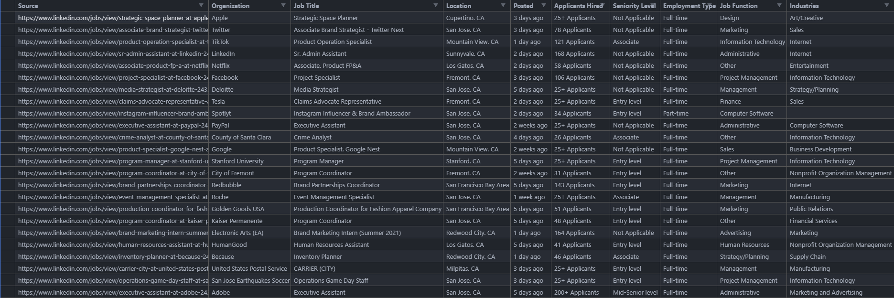

<h1 align="center"> Find Jobs on LinkedIn </h1>

<li>📔 This program finds jobs by scraping on LinkedIn</li>
<li>👨‍💻 Relies on User Input. Accepts: Country, City, State</li>
<li>📑 Data about jobs will be generated as .csv format. </li>

#

<h2 align="center">
<a href="https://asciinema.org/a/398283">
Click Me To See Demo
</a>
</h2>


## Installation:
```console
# clone the repo
$ git clone https://github.com/KungPaoChick/Find_LinkedIn_jobs.git

# change the working directory to Find_LinkedIn_jobs
$ cd Find_LinkedIn_jobs/

# install the requirements
$ python -m pip install -r requirements.txt

```

## Usage:

```console
$ python search_jobs.py --help
usage: search_jobs.py [-h] [-p PLACES [PLACES ...]] [-j jobfunction [jobfunction ...]] [-jp job place]

Find Nearby or Faraway Jobs

optional arguments:
  -h, --help            show this help message and exit
  -p PLACES [PLACES ...], --place PLACES [PLACES ...]
                        Enter country/city/state. One or more places to look jobs from.
  -j jobfunction [jobfunction ...], --jobfunction jobfunction [jobfunction ...]
                        Searches Job Specification in your area. (e.g software-engineer)
  -jp job place, --jobplace job place
                        Searches The Specified Job in the Specified Place. (e.g teacher iowa)

```


To search for only one place:
```console
$ python search_jobs.py -p san-jose
```

To search for more than one place:
```
$ python search_jobs.py -p california texas arizona
```

To search a Specific job in your area:
```
$ python search_jobs.py -j teacher
```

To search Specific more than one job in your area:
```
$ python search_jobs.py -j teacher engineer designer
```

To search a Specific Job in a Specific Location:
```
$ python search_jobs.py -jp designer san-jose
```

Data collected will be stored in an individual csv file inside of its respective folder (e.g ```jobs_in_san-jose.csv```)

<h3>Result:<h3/>


## Contributing
We would love to have you help us with the development of Jobs_LinkedIn. Each and every contribution is greatly valued!